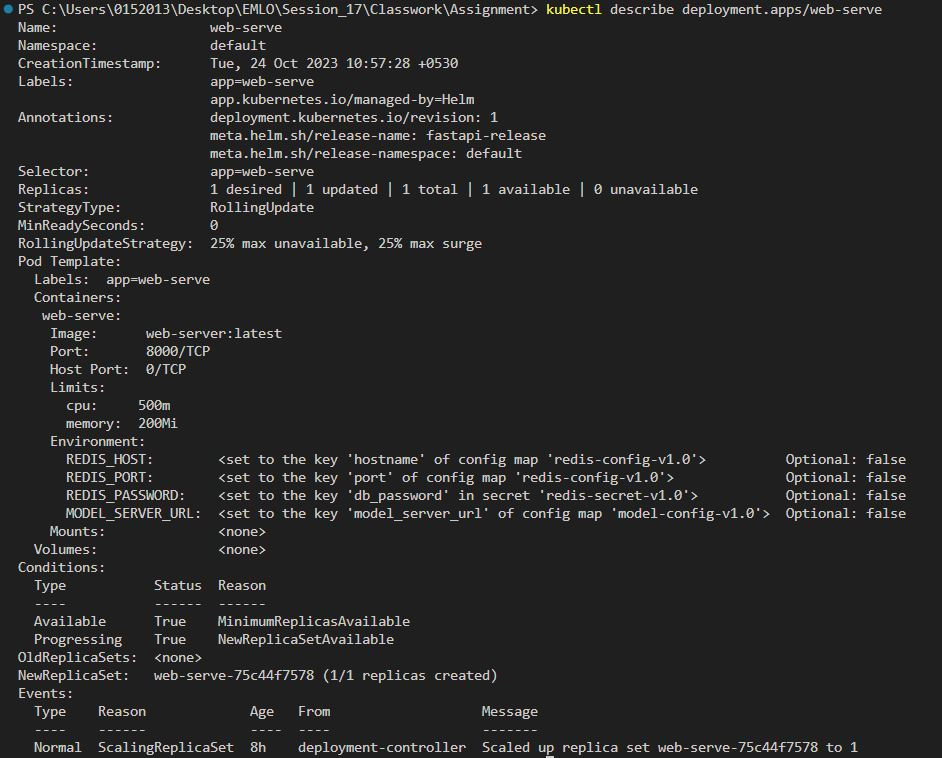

# Deploy GPT2  model with FastAPI using MiniKube Cluster abd Helm

Provide the text sentence as an input the model will complete the sentence using GPT2 model


![fastapi[all]](https://img.shields.io/badge/fastapi[all]-0.98.0-green)


## Docker Image

Build docker image: `docker compose build`  
Run docker image: `docker compose up`


## How to run the code using Minikube 
- Start MiniKube with local docker desktop

Tick mark on `Enable Kubernetes` in Kubernetes option of docker desktop settings.

Run `minikube start --driver=docker` to start minikube cluster.

- Create the Deployment: 
```
# Load docker image to minikube
minikube image load web-server:latest
minikube image load model-server:latest

# Check the images in minikube 
minikube image ls

# Create deployment
kubectl create namespace emlo
kubectl apply -f . --namespace=emlo

# Check status of all pods
kubectl get all

```

- Tunnel to the Ingress

To use Ingress in Minikube, enable addons by running below commands:

```
minikube addons enable ingress
minikube addons enable dashboard
minikube addons enable metrics-server
```
Now tunnel the minikube node to localhost: `minikube tunnel`


## How to run the code using Helm 
```
# Run the templates and values in helm 
helm install fastapi-release .\fastapi-helm

# Check status of all pods
kubectl get all

# Check the helm release 
helm ls --all-namespaces
```


- Access the FastAPI docs page: `http://fastapi.localhost/docs`


---------------------------------------------------------

`Check if the redis service is working:`

kubectl run ubuntu --rm -i --tty --image=ubuntu -- bash
redis-cli -h redis-db-service -a "aiwilltakeovertheworld"

---------------------------------------------------------

`You can create a tunnel to the service with minikube:`

minikube service web-server-service

---------------------------------------------------------

## Steps to check details

- Get details of Model deployment
```
kubectl describe deployment.apps/model-serve 
```


- Get details of Web deployment
```
kubectl describe deployment.apps/web-serve 
```


- Get details of the model Pod
```
kubectl describe pod/pod/model-serve-5fcf896dfd-8zbnv
```


- Get details of the Web Pod
```
kubectl describe pod/pod/pod/web-serve-75c44f7578-bk2c5 
```


- Get details of the ingress
```
kubectl describe incress clip-ingress
```


- Check for CPU and Memory usage by each pod
```
kubectl top pod
```


- Check details of node(s)
```
kubectl top node
```


- Get details of all yaml configuration
```
kubectl get all -A -o yaml
```


## Group Members
- Anurag Mittal
- Aman Jaipuria
